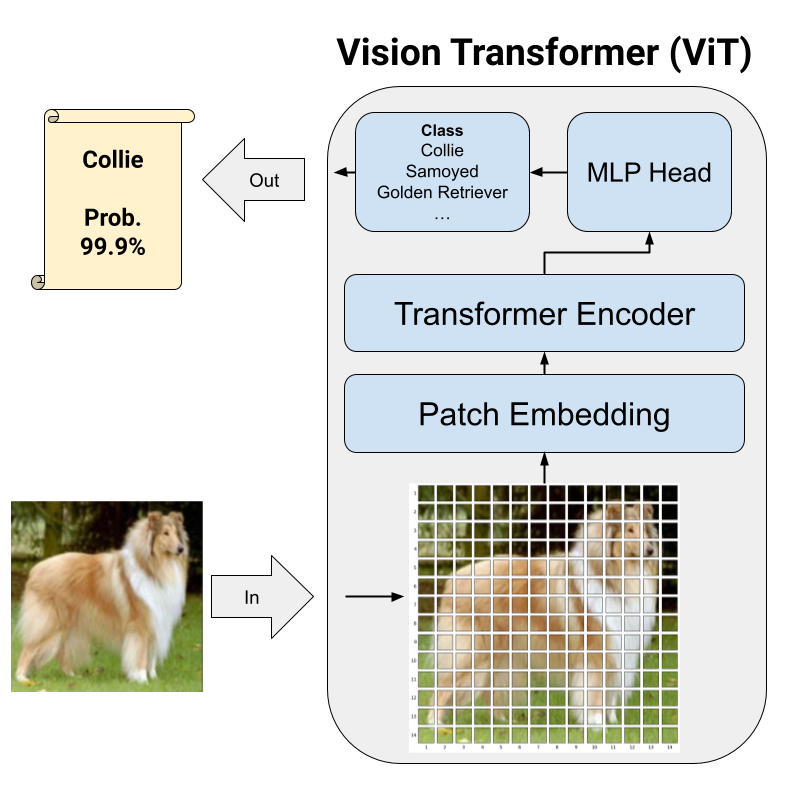

# Building Vision Transformer From Scratch For Image Classification
The reserach paper, ["An Image is Worth 16x16 Words: Transformers for Image Recognition at Scale"](https://arxiv.org/abs/2010.11929), introduced a **Vision Transformer (ViT)** into computer vision, delivering state-of-the-art performance without relying on convolutional neural networks (CNNs). This innovation draws inspiration from the highly regarded Transformer architecture in natural language processing domain, where Transformers have outperformed CNNs. The goal of the project is to implement the paper and grasp the essential concepts in the Vision Transformer. We constructed the Vision Transformer (ViT) from scratch using PyTorch, conducted training with augmented data, and subsequently applied the model to perform image classification to identify dog breeds.

In this project, we are going to implement the **Vision Transformer (ViT)** from scratch using PyTorch, and use the model to perform image classification for different breeds of dogs. 

## What are out tasks?
- **Task 1**: Build the Vision Transformer (ViT) from scratch. Implement each layers in the ViT model.
- **Task 2**: Apply Transfer Learning. Use the pretrained-ViT and make a comparison.
- **Task 3**: Perform image classification on a given image. Identify the breed type of the dog in the image.
  
## Project Pipeline


## What dataset will we use?
We use Stanford Dogs Dataset. The dataset contains 20,850 images for 120 breeds of dogs. The dataset is also a subset of a large scale image database, ImageNet.

### Download way 1
You can download the dataset from either one of the two sites.
- [http://vision.stanford.edu/aditya86/ImageNetDogs/](http://vision.stanford.edu/aditya86/ImageNetDogs/)
- [https://www.kaggle.com/datasets/jessicali9530/stanford-dogs-dataset/](https://www.kaggle.com/datasets/jessicali9530/stanford-dogs-dataset/)

You could use the *wget* command to download the tar files and then decompress the files. 

### Download way 2
We will use a subset of Stanford Dogs dataset for this notebook. The subet only contain 3 dog breeds. The downloading link is:
- [myImage.zip](https://github.com/patrick-yp-yu/vit_classification/blob/main/datasets/StanfordDogsDataset/myImages.zip)


**Notes:** please follow the specified directory structure. After decompress files, please copy your classification target images under the folder **./datasets/StanfordDogsDataset/myImages**

```
###### Directory Structure
# ${ROOT}  
# |-- assets (assets for the notebook)
# |-- images (images for testing)
# |-- datasets 
# |   |-- StanfordDogsDataset
# |   |   |-- Annotation
# |   |   |   |-- n02085620-Chihuahua
# |   |   |   |-- ...
# |   |   |   |-- ...
# |   |   |-- Images
# |   |   |   |-- n02085620-Chihuahua
# |   |   |   |-- ...
# |   |   |   |-- ...
# |   |   |-- myImages
# |   |   |   |-- your choice of dog 1 for image classification
# |   |   |   |-- your choice of dog 2 for image classification
# |   |   |   |-- your choice of dog 3 for image classification
# |   |   |   |-- ...
```
